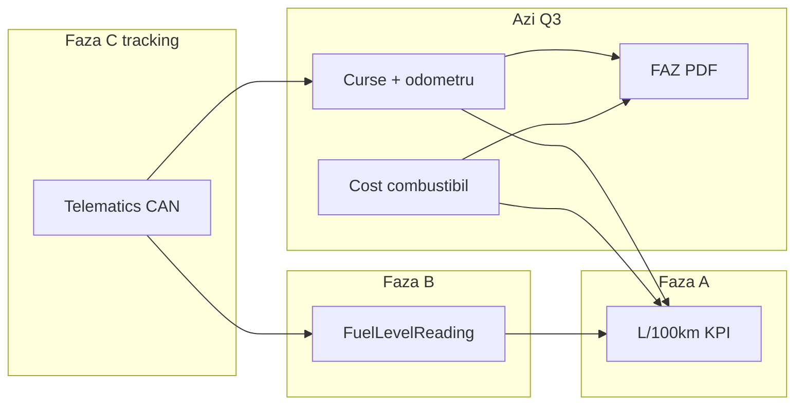

# Roadmap trimestrial 2026 — client pilot

Acest document fixează **cum continuăm** după shell Variant C, FAZ-lite și ops core. Este aliniat la `release-governance.md` (cadenta trimestrială) și la gap-ul identificat față de `phase1-mvp-scope.md`.

**IAM / useri / roluri (canonic):** [`identity-access-model.md`](identity-access-model.md) — orice epic care atinge accesul sau ierarhia trebuie aliniat la acest document înainte de implementare.

**ICP ales:** **client pilot** — o firmă reală (sau divizie internă) care folosește zilnic aplicația pentru evidența flotei, conformitate și raportare, **fără GPS/tracking în Q3–Q4**.

---

## 1. ICP — client pilot

| Dimensiune | Definiție |
|------------|-----------|
| **Cine** | Administrator flotă / dispecer + eventual contabil (același tenant) |
| **Mărime** | ~20–150 vehicule (mix turism, van, cap tractor — nu e critic la început) |
| **Geografie** | România |
| **Job-to-be-done** | Știe ce expiră (ITP, documente), închide remindere, generează FAZ/foi de parcurs, vede costuri și mentenanță **per client contractual** |
| **Nu în scope pilot** | Hartă live, tahograf integrat, portal furnizori, facturare, pachete `T+P*` |
| **Succes pilot** | Folosire săptămânală ≥ 8 săptămâni; ≥ 80% vehicule cu client asignat (entitate); ≥ 1 pachet FAZ lunar generat și re-descărcat; zero incidente tenant leak |

**Implicație produse:** tot ce construim în Q3–Q4 trebuie să fie **demonstrabil cap-coadă** pentru acest utilizator, nu „meniu pregătit pentru viitor”.

---

## 2. Stare curentă (baseline — iunie 2026)

**Livrat și pe `main`:**

- Multi-tenant, JWT, roluri `tenant_admin` / `tenant_viewer`, audit, membri
- Vehicule (CIV extins, ITP, odometru, plan mentenanță), documente, remindere, mentenanță, costuri, curse
- FAZ-lite: PDF foaie de parcurs + FAZ lunar, arhivă, filtre, seed demo
- UI shell Variant C (`fleet-nav.ts`, sidebar grupat, mobil drawer + bottom bar)
- Deploy: API Cloud Run, web staging, Neon Postgres

**Datorii explicite de adresat în Q3:**

- `Vehicle.clientId` = string liber (fără `Client`)
- PDF în `TripSheetDocument.pdfData` (BYTEA)
- Fără dashboard / KPI agregate
- Liste mobil = încă tabele; fără CRM

---

## 3. Q3 2026 (iulie – septembrie) — Client + dashboard + storage

**Obiectiv trimestru:** pilotul poate lucra **per organizație client**, vede **situația flotei într-un singur ecran**, iar documentele PDF **nu mai umflă baza de date**.

### 3.1 Epic: Modul Client (organizații)

| Livrabil | Detaliu |
|----------|---------|
| Schema | `Client` (tenant-scoped): `id`, `code`, `legalName`, `taxId?`, `status`, `notes`, timestamps |
| Migrare | Mapare `Vehicle.clientId` string → `clientId` FK (păstrare `code` pentru compatibilitate sau migrare one-shot din valori existente) |
| API | CRUD `/clients`, listă paginată, filtru activ/inactiv |
| Web | Listă + formular; selector Client pe vehicul, curse, remindere, costuri, mentenanță, wizard FAZ |
| Nav | Item „Clienți (organizații)” → **live** în `fleet-nav.ts` |
| Audit | create/update/delete Client |

**Criterii acceptanță:**

- [ ] Nu se poate salva vehicul fără client valid (sau politică explicită „client intern” unic per tenant)
- [ ] Filtre listă vehicule / curse / FAZ după `clientId` real
- [ ] Export CSV vehicule include denumire client, nu doar cod

**Out of scope Q3:** contacte multiple, adrese, contracte SLA, portal pentru client final.

### 3.2 Epic: Panou general (dashboard)

| Livrabil | Detaliu |
|----------|---------|
| Rută | `/fleet` sau `/fleet/dashboard` — prima destinație după login (redirect din Acasă mobil) |
| KPI (minim) | Total vehicule active; ITP în 30/60 zile; remindere deschise / overdue; documente expirate sau în 30 zile; costuri luna curentă (sumar); curse luna curentă (count) |
| API | `GET /fleet/dashboard` sau agregate în servicii existente (un endpoint dedicat preferat) |
| UI | `FleetPageMain` + grid KPI + 2 liste scurte (remindere due, ITP soon) |
| Nav | „Panou general” → **live** |

**Criterii acceptanță:**

- [ ] Timp încărcare dashboard p95 &lt; 2s pe staging (tenant demo, &lt; 200 vehicule)
- [ ] Click pe KPI duce la listă pre-filtrată

### 3.3 Epic: Stocare documente PDF (object storage)

| Livrabil | Detaliu |
|----------|---------|
| Storage | GCS bucket (același proiect GCP); path `tenants/{slug}/trip-sheets/{id}.pdf` |
| Schema | `TripSheetDocument`: `pdfStorageKey` + `pdfByteSize`; migrare date noi; opțional backfill script pentru înregistrări existente |
| API | Generare → upload GCS; `GET .../pdf` → signed URL sau stream proxy |
| Securitate | Signed URL scurt (ex. 15 min), tenant check înainte de emitere |
| Env | `GCS_BUCKET`, SA key sau workload identity pe Cloud Run |

**Criterii acceptanță:**

- [ ] PDF nou nu mai scrie în BYTEA
- [ ] Descărcare funcționează pentru viewer și admin
- [ ] Documentație runbook în `api/README.md` (bucket, IAM)

### 3.4 Calitate & operare Q3

| Livrabil | Detaliu |
|----------|---------|
| Teste | e2e: Client CRUD + vehicul legat; trip-sheet generate + download; tenant isolation pe `/clients` |
| Securitate | Eliminare fallback `TenantId` → `'default'` în producție |
| Tech debt mic | Extragere `ops-dates.ts` (parsare date partajată) — opțional dacă atinge fișiere atinse |

**Milestone sfârșit Q3:** **Go-live pilot** pe staging → producție limitată pentru client pilot, cu checklist semnat (dashboard + clienți + FAZ per client). Checklist: `docs/go-live-pilot-checklist.md`.

---

## 4. Q4 2026 (octombrie – decembrie) — CRM minim + mobil

**Obiectiv trimestru:** pilotul poate deschide **tichete simple** legate de flotă și poate lucra **pe telefon** la remindere și vehicule, fără tracking.

### 4.1 Epic: CRM minim

| Livrabil | Detaliu |
|----------|---------|
| Schema | `CrmTicket`: `tenantId`, `clientId`, `subject`, `description`, `status` (`open` \| `in_progress` \| `resolved` \| `cancelled`), `priority`, legături opționale `vehicleId`, `reminderActionId` |
| API | CRUD + listă filtre (client, status, vehicul) |
| Web | Listă + detaliu + formular; link „Deschide tichet” din remindere / vehicul |
| Nav | „Tichete CRM” → **live** |
| Audit | tranziții status |

**Criterii acceptanță:**

- [ ] Flux: reminder overdue → tichet → rezolvat → reminder închis (manual sau ghidat)
- [ ] Filtru tichete per client pilot

**Out of scope Q4:** SLA, email inbound, portal furnizori, automatizări, tipuri ticket configurabile.

### 4.2 Epic: Mobil operațional (liste)

| Livrabil | Detaliu |
|----------|---------|
| Componentă | `FleetResponsiveList` — tabel `lg+`, carduri sub `lg` |
| Pagini pilot | Vehicule, Remindere (apoi opțional documente expirate) |
| UX | Acțiuni principale vizibile pe card (vezi, editează dacă admin) |
| Docs | Actualizare `ui-shell.md` |

**Criterii acceptanță:**

- [ ] Utilizabil pe viewport 390px fără scroll orizontal pe listă
- [ ] Feedback pilot: „pot verifica reminderele în parcărie” (test sesiune 30 min)

### 4.3 Epic: Șoferi (pregătire, nu integrare tahograf)

| Livrabil | Detaliu |
|----------|---------|
| Schema | `Driver` (tenant): `name`, `licenseId?`, `clientId?`, `status` |
| Trip | `driverId` FK opțional; păstrare `driverName` pentru istoric |
| UI | Selector șofer în formular cursă; listă simplă șoferi |

**Notă:** tab Tahograf rămâne placeholder până la integrare hardware / reguli legale clarificate.

### 4.4 Calitate Q4

| Livrabil | Detaliu |
|----------|---------|
| Teste | e2e tichet CRM + legătură reminder; smoke mobil pe CI (Playwright opțional, 1 flux) |
| Refactor | Început împărțire `fleet.service.ts` (vehicule + CIV într-un modul dedicat) dacă atins de Client |

**Milestone sfârșit Q4:** **Retrospectivă pilot** — decizie: extindere la al 2-lea client, sau intrare Phase 1 tracking (Q1 2027).

---

## 5. Ce NU facem în Q3–Q4 (explicit)

- Tracking GPS / hartă live
- Portal furnizori, devize, financiar (facturi)
- Conformitate F2 (vignete, RAR integrat, asistență rutieră)
- i18n EN/DE (UI rămâne RO; copy tehnic poate rămâne mixt de curățat treptat)
- FAZ „pro” / validare legală completă fără consultant
- Pachete comerciale `T+P*` în billing

---

## 6. Mapare meniu Variant C → trimestre

| Item sidebar | Q3 | Q4 |
|--------------|----|----|
| Panou general | live | — |
| Clienți (organizații) | live | — |
| Tichete CRM | F1 (soon) | live |
| Șoferi & utilizatori | — | live (șoferi) |
| Tracking / Hartă | soon | soon |
| Restul Flotă | deja live | + liste mobil |

---

## 7. Metrici trimestriale (pilot)

| Metrică | Țintă Q3 | Țintă Q4 |
|---------|----------|----------|
| Vehicule cu `Client` FK valid | 100% | menținut |
| Sesiuni active / săptămână (tenant pilot) | ≥ 3 | ≥ 5 |
| FAZ lunar generate / lună | ≥ 1 | ≥ 1 |
| Tichete CRM create / lună | — | ≥ 5 |
| Incidente securitate tenant | 0 | 0 |
| Regresii post-deploy (critice) | 0 | 0 |

---

## 8. Ordine recomandată în backlog (sprint-uri)

**Q3 — ordine strictă:**

1. Client schema + API + UI listă/form  
2. Migrare `clientId` pe vehicule + filtre  
3. Dashboard API + pagină  
4. GCS PDF + migrare trip-sheets  
5. Teste e2e + hardening tenant  
6. Go-live pilot  

**Q4 — ordine strictă:**

1. **Consum combustibil Faza A** (§10) — KPI L/100km, legătură alimentări ↔ curse  
2. CRM ticket schema + API + UI  
3. Legături reminder ↔ tichet  
4. `FleetResponsiveList` pe vehicule + remindere  
5. Driver entity + trip form  
6. **Faza B–C tracking** (§10) — `FuelLevelReading`, ingest telemetrie — după alegere furnizor  
7. Retrospectivă pilot  

---

## 9. Referințe

- `docs/phase1-mvp-scope.md` — viziune lungă (după pilot)
- `docs/domain-model.md` — țintă canonică (`clientId`, `Job`, `Event`)
- `docs/ui-shell.md` — shell UI
- `docs/service-catalog.md` — module viitoare (F2+)
- `web/src/lib/fleet-nav.ts` — sursă meniu

**Revizuire:** la sfârșitul fiecărui trimestru; ajustare backlog cu feedback client pilot (max 1 pagină note în acest fișier, secțiunea de mai jos).

### Note pilot (de completat)

| Data | Observație | Impact backlog |
|------|------------|----------------|
| 2026-06 | Tenant **FlotaX** — smoke cap-coadă pe 1 vehicul (costuri, documente, remindere, curse, mentenanță). Totul OK. | Go-live pilot fezabil; îmbunătățiri incrementale |
| 2026-06 | **Revenire obligatorie:** consum combustibil în modul Curse — acum FAZ agregă litri din `CostEntry` categorie `combustibil`, nu consum derivat pe cursă. | Epic §10 — fazat manual → telemetrie |
| 2026-06 | **Feedback scurt pilot (handoff §5.1):** formulare ops 40/60 + P1, profil vehicul (achiziție/foto), mentenanță garanție/daună, vehicul imuabil la edit. Istoric la scară mare — amânat. | Livrat Q3 incremental; consum curse rămâne epic §10 |
| 2026-06-21 | **Curse/Consum Faza A (parțial):** `GET /trips/consumption`, tab Consum, segmente fill-to-fill, reconciliere km, filtre; distanță cursă din odometru; tip combustibil pe cost | Livrat pe `main`; CAN + Setări tenant → §10.1 |
| 2026-06 | **IAM canonic:** `docs/identity-access-model.md` — SaaS multi-tenant, FlotaX = abonat, platform_admin viitor | Referință din toate doc-urile cheie |

---

## 10. Epic obligatoriu post-pilot: consum combustibil & tracking (Curse)

**Problemă:** consumul în FAZ/foi de parcurs vine din **alimentări** (`CostEntry` + `fuelLiters`), nu din **consum pe distanță** (L/100 km) și nu din **nivel rezervor**. Fără odometru consistent, raportul e incomplet.

**Țintă:** consum credibil per vehicul / perioadă / cursă, pregătit pentru integrare tracking (CAN: litri rezervor, % combustibil).

### Faza A — fără GPS (1–2 sprinturi, poate înainte de tracking)

| Livrabil | Detaliu | Stare |
|----------|---------|--------|
| Reguli date | Validare cursă: `odometerEndKm ≥ odometerStartKm`, `distanceKm` aliniat la delta odometru | ☑ livrat 2026-06 |
| Tab Consum + KPI | `GET /trips/consumption`, segmente fill-to-fill L/100km, reconciliere km, filtre vehicul/tip energie | ☑ livrat 2026-06 |
| Tip combustibil cost | `fuelProductType` pe Combustibil; infer din CIV P.3 | ☑ livrat 2026-06 |
| Legătură cost ↔ cursă | `CostEntry.tripId?` opțional; la alimentare, opțional „cursă / perioadă” | ☐ backlog |
| KPI consum per vehicul | `GET /fleet/vehicles/:id/consumption?from&to` — reutilizare engine | ☐ backlog |
| UI panou vehicul | Consum perioadă pe profil vehicul; FAZ păstrează agregarea zilnică | ☐ backlog |

**Acceptanță:** pentru un vehicul pilot, L/100km calculat din sumă litri ÷ km (odometru sau curse) în perioada FAZ.

### Faza B — citiri rezervor manuale + telemetrie ușoară

| Livrabil | Detaliu |
|----------|---------|
| Schema | `FuelLevelReading`: `vehicleId`, `recordedAt`, `liters?`, `percent?`, `source` (`manual` \| `import` \| `telematics`) |
| UI | Formular rapid „nivel rezervor” (șofer/admin); istoric pe vehicul |
| Logică | La alimentare: `liters_added` ≈ delta nivel (înainte/după) + bon; flag inconsistență |
| API ingest | `POST /integrations/telematics/fuel-readings` (API key per tenant), payload normalizat |

### Faza C — modul tracking (Q4+ / partener)

| Livrabil | Detaliu |
|----------|---------|
| Integrare | Adapter per furnizor (webhook sau poll): poziție GPS + **fuel level CAN** + odometru CAN |
| Evenimente | `TelematicsEvent` — mapare la `Trip` (auto-detect segment) sau sugestie cursă de confirmat |
| Consum | **Prioritate citiri:** CAN rezervor > odometru > distanță manuală; alimentări = ground truth pentru refill |
| UI | Hartă / timeline (nav „Tracking” deja `soon`); overlay consum pe zi |

**Decizie de discutat cu pilotul:** toleranță la date incomplete (estimare vs blocare FAZ), frecvența citirilor rezervor, furnizor tracking preferat (API deschis).

**Out of scope inițial:** rutare optimă, geofencing, control viteză.

### 10.1 Odometru CAN — decizie produs (2026-06-21)

**Context:** la integrarea tracking, odometrul vine din **CAN** (nu tastat de șofer). Modulul de **gestiune useri / setări tenant** va include și **monitorizarea km** (vehicule cu device, stare semnal, ultima citire).

**Decizie recomandată — model hibrid (nu eliminăm manualul complet):**

| Situație | Comportament km |
|----------|-----------------|
| Vehicul **cu tracking activ** + semnal CAN **valid** (ultima citire ≤ prag, ex. 24h) | Km **completat automat** la data/ora evenimentului; câmp **read-only** în UI; sursă = `telematics` |
| Vehicul cu tracking, semnal **expirat** (offline / defect) | Permitem **manual** cu badge „fără CAN”; avertisment în Consum / FAZ |
| Vehicul **fără** device tracking | **Manual** ca azi (`manual` / `import`) |
| Conflict manual vs CAN (> prag, ex. 2% sau 5 km) | Păstrăm CAN ca valoare autoritară; manual → `OdometerReading` cu flag `conflict`; audit + notificare admin |

**Regula de completare automată (concretă):**

1. Fiecare ping CAN creează/actualizează `OdometerReading` (`source=telematics`, `recordedAt`, `odometerKm`).
2. La **salvare cost Combustibil**, **cursă**, **mentenanță** cu timestamp `T`: serviciu `resolveOdometerAt(vehicleId, T)` → cea mai apropiată citire CAN ≤ `T` (sau interpolare între două citiri dacă gap < 15 min).
3. **`distanceKm` pe cursă** = mereu derivat din odometru start/final (CAN sau manual), nu tastat separat când ambele există.
4. **Consum L/100km** rămâne pe **km odometru la alimentări** — la tracking, acel km vine din CAN la `incurredOn`, nu din curse.

**Ce NU facem:** eliminarea totală a introducerii manuale — rămâne **fallback obligatoriu** pentru vehicule fără device, perioade pre-tracking, și incidente telemetrie.

**Pregătire tehnică (înainte de Faza C):**

- Extinde `OdometerReading.source`: `manual` \| `import` \| `telematics`
- API intern `OdometerResolver.resolveAt(vehicleId, at)` — folosit de toate formularele ops
- UI Setări tenant: listă vehicule + „tracking activ”, „ultima citire CAN”, prag offline
- Poziționare UI: **Setări / Administrare** (același epic cu **user management**), nu în fiecare formular

**Acceptanță Faza C (odometru):** pentru un vehicul cu CAN, o alimentare și o cursă create fără tastare km — câmpurile odometru populate corect din citirea CAN la data/ora evenimentului; Consum calculează segment L/100km fără intervenție manuală.
