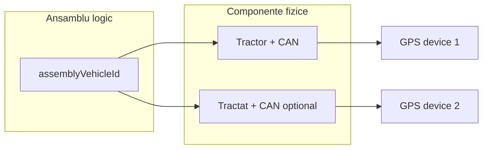

# TODO — Ansambluri vehicule (compunere rutieră)

**Status:** Faza 0 — buton UI + acest document.  
**Referințe:** [`domain-model.md`](domain-model.md) (`composedWithTrailerId`), [`roadmap-2026-q3-q4.md`](roadmap-2026-q3-q4.md) §10 (tracking / telemetrie).

---

## 1. Problemă de business

În flote reale, operațiunea se face adesea pe **ansamblu**, nu pe un singur vehicul:

| Exemplu | Tractor (vehicul 1) | Tractat (vehicul 2) |
|---------|---------------------|---------------------|
| Transport greu | Cap tractor | Semiremorcă |
| Van + remorcă | Van 7t | Remorcă |
| Autoutilitară | Autoutilitară | Remorcă ușoară |

**Trei dimensiuni independente:**

1. **Compunerea** — care vehicule formează ansamblul (tractor + tractat).
2. **Durata compunerii** — permanentă (cuplaj fix) sau temporară (cuplaj la o dată, dezmembrare ulterioară).
3. **Șoferul** — alocat pe ansamblu, permanent sau temporar (schimb tură, înlocuitor).

Ansamblul trebuie să se comporte ca **un vehicul standard** în tot restul aplicației: curse, consum, documente, mentenanță, costuri, remindere, FAZ, alocări șofer, rapoarte.

---

## 2. Principiu de model (recomandat)

**Ansamblul = entitate `Vehicle` de tip dedicat + metadate de compunere**, nu doar un câmp `composedWithTrailerId` pe tractor.

Motivație:

- Un singur `vehicleId` în curse, costuri, documente (ca azi).
- Listele și filtrele rămân coerente („nr. înmatriculare ansamblu” = tractor sau etichetă compusă).
- Componentele (tractor, remorcă) rămân vehicule independente cu propriul CIV, ITP, tracking.

Alternativă respinsă pe termen lung: curse cu `vehicleId` + `trailerId` obligatoriu — fragmentează consumul, FAZ și permisiunile șoferului.

---

## 3. Faze de implementare

### Faza 0 — Pregătire UI (acum)

- [x] Buton **„Ansamblu nou”** pe lista vehicule → `/fleet/vehicles/assemblies/new`
- [x] Pagină placeholder cu scop și dependențe
- [x] Acest document TODO

### Faza 1 — Model date & API

- [ ] Prisma: `VehicleAssembly` (sau echivalent)
  - `id`, `tenantId`, `clientId`
  - `tractorVehicleId`, `trailedVehicleId` (FK → `Vehicle`)
  - `displayRegistration` (opțional; default = nr. tractor)
  - `compositionType`: `permanent` | `temporary`
  - `validFrom`, `validTo?` (pentru temporar)
  - `status`: `active` | `dissolved`
  - `assemblyVehicleId` — FK către `Vehicle` „umbrelă” (tip nou, ex. `road_train`)
- [ ] `Vehicle.type`: valoare `road_train` / `assembly` pentru vehiculul logic
- [ ] Reguli: același client; tractatul nu poate fi în două ansambluri active; tractorul idem
- [ ] Migrare: înlocuire graduală a câmpului canonic `composedWithTrailerId` din `domain-model.md`
- [ ] API: `POST/GET/PATCH /fleet/assemblies`, listă paginată, dizolvare ansamblu
- [ ] Audit: create / update / dissolve

### Faza 2 — UI compunere

- [ ] Wizard **Ansamblu nou**: select tractor → select tractat → tip permanent/temporar → perioadă
- [ ] Preview: MTMA ansamblu (CIV rubrică 6), ITP-uri componente, restricții tip vehicul
- [ ] Listă vehicule: badge „Ansamblu” + link către componente
- [ ] Detaliu ansamblu: tab „Compunere” (tractor, tractat, istoric cuplaje)
- [ ] Acțiune „Dezmembrare” (închide `validTo`, status `dissolved`, tractatul revine liber)

### Faza 3 — Șofer pe ansamblu

- [ ] Alocare șofer pe `assemblyVehicleId` (reutilizare `DriverVehicleAssignment` cu `vehicleId` = ansamblu)
- [ ] Suport **permanent** vs **temporar** (`validFrom` / `validTo` pe assignment — extindere model existent sau tabel `DriverAssemblyAssignment`)
- [ ] Portal șofer L0: scope pe ansamblu activ, nu doar tractor
- [ ] Curse: `driverId` + `vehicleId` = ansamblu; componentele doar în detaliu / audit

### Faza 4 — Paritate cu vehicul standard

Ansamblul (`assemblyVehicleId`) trebuie să funcționeze în:

- [ ] Curse & consum (km, alimentări, segmente fill-to-fill)
- [ ] Documente vehicul & remindere (ITP ansamblu vs componente — reguli de agregare)
- [ ] Mentenanță & plan preventiv
- [ ] Costuri (alocare pe ansamblu; opțional split pe componentă)
- [ ] FAZ / foi de parcurs (un singur vehicul selectat = ansamblu)
- [ ] Export CSV, dashboard KPI
- [ ] Permisiuni IAM: același scope client ca vehiculele componente

**Reguli de agregare de clarificat cu pilot:**

- Odometru ansamblu = odometru tractor (implicit) sau max(tractor, tractat) dacă tractatul are propriu contor?
- ITP / RCA: alertă la cea mai apropiată expirare dintre componente sau doar tractor?

### Faza 5 — Tracking & telemetrie (complexitate ridicată)

Când intră integrarea GPS/CAN ([`roadmap-2026-q3-q4.md`](roadmap-2026-q3-q4.md) §10):

- [ ] **Două device-uri** pe ansamblu: unul pe tractor, unul pe tractat (dacă echipat)
- [ ] Model `TelematicsDevice`: `vehicleId` → componentă fizică, nu ansamblul logic
- [ ] Hartă / poziție ansamblu: default poziția tractorului; tractat = offset sau ultimă poziție remorcă
- [ ] Odometru CAN: rezolvare la nivel ansamblu (`resolveOdometerAt(assemblyVehicleId, T)` → citire tractor)
- [ ] Evenimente tractat (ușă, temperatură frigo): `Event.entityId` = vehicul componentă; dashboard ansamblu agregă ambele
- [ ] Stare offline: tractor online + tractat offline → badge parțial; fallback manual km
- [ ] Consum: alimentări pe tractor; segmente km ansamblu

---

## 4. Impact pe module existente (checklist analiză)

| Modul | Impact |
|-------|--------|
| `Vehicle` / CIV | Tip `road_train`; rubrici MTMA ansamblu |
| `DriverVehicleAssignment` | Alocare pe ansamblu; istoric |
| `Trip` | `vehicleId` = ansamblu; filtre consum |
| `TripSheetDocument` | Select vehicul = ansamblu |
| `ConsumptionEngine` | Km / L100 pe ansamblu |
| `MaintenancePlan` | Scope tip vehicul include ansamblu |
| `CostRecord` | Alocare default ansamblu |
| `driver-access.ts` | Scope șofer: ansamblu activ + componente din istoric |
| `fleet-nav` / liste | Coloană tip + badge ansamblu |
| Integrare tracking | Dual-device, agregare evenimente |

---

## 5. Denomiri UI (decizie)

| Context | Termen recomandat |
|---------|-------------------|
| Buton listă vehicule | **Ansamblu nou** |
| Entitate / tip vehicul | **Ansamblu rutier** (`road_train`) |
| Acțiune compunere | **Compunere ansamblu** |
| Acțiune inversă | **Dezmembrare** |

---

## 6. Criterii de acceptanță (MVP ansamblu — Faza 2–4)

- [ ] Pot crea ansamblu permanent cap tractor + semiremorcă; apare în listă ca vehicul
- [ ] Pot crea ansamblu temporar cu dată sfârșit; la expirare tractatul devine liber
- [ ] Pot aloca șofer pe ansamblu; șoferul vede ansamblul în portal
- [ ] Pot deschide cursă pe ansamblu; consumul se calculează pe ansamblu
- [ ] Nu pot cupla aceeași remorcă în două ansambluri active
- [ ] Dezmembrarea păstrează istoricul în audit

---

## 7. Out of scope (inițial)

- Ansamblu cu &gt; 2 vehicule (road train multi-remorcă)
- Optimizare automată cuplaj tractor–remorcă
- Tahograf pe ansamblu (modul separat)

---

*Ultima actualizare: 2026-05-31 — Faza 0.*
